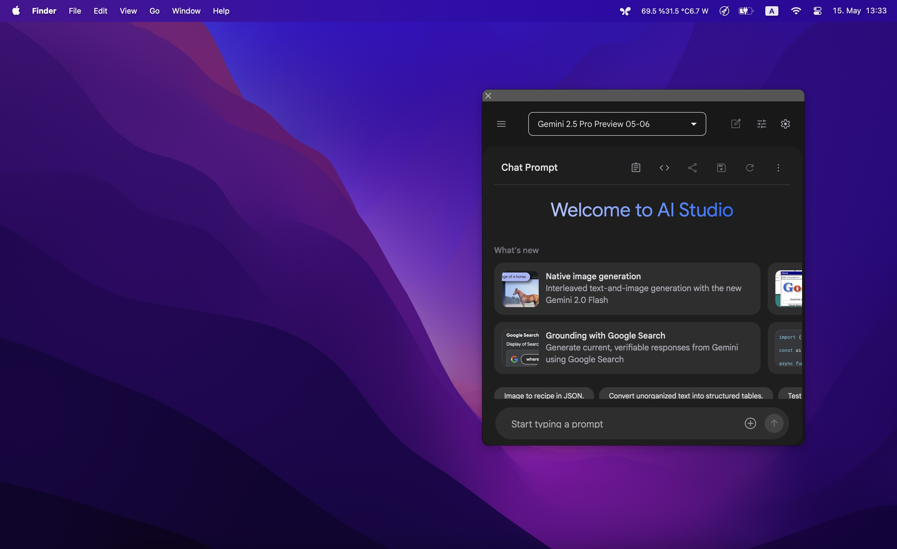
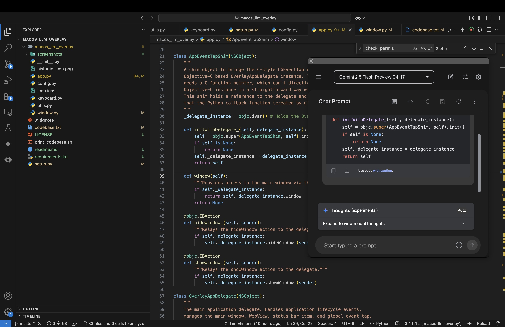
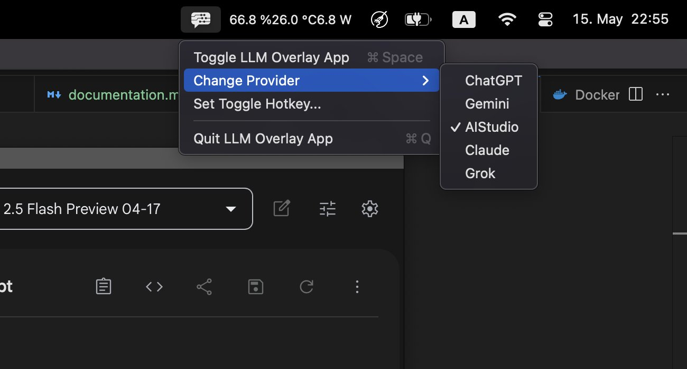
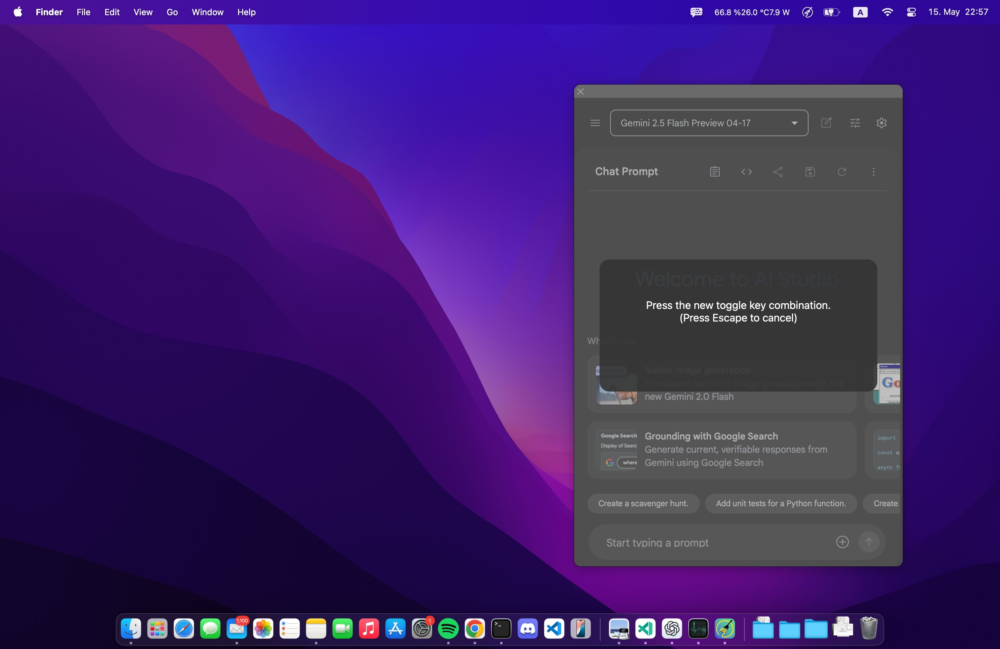

# macOS LLM Overlay

**macos_llm_overlay** is a macOS application that provides a configurable overlay window to display web content, intended for quick access to Large Language Model (LLM) interfaces like Google's AI Studio or similar web-based AI tools. It features a global hotkey to toggle visibility and can be run as a background agent application.

## Features

* **Overlay Window**: Displays web content (e.g., AI Studio) in a floating, borderless window with a draggable top bar and close button.
* **Global Hotkey**: Toggle window visibility with a customizable hotkey (default: Command + Space).
* **Status Bar Menu**: Control the app (toggle window, set hotkey, quit) from the macOS menu bar.
* **Background Operation**: Runs without a Dock icon for minimal distraction.
* **Persistence**: Saves window position, size, and hotkey settings between sessions.
* **Logging**: Records errors for troubleshooting.

## Screenshot








## Prerequisites

*   **macOS**: Developed and tested on macOS.
*   **Python**: Python 3.9 or newer. !!PYTHON 3.12 DOES NOT WORK!! (please don't ask me why)
*   **Xcode Command Line Tools**: Required **only** if building the application from source. It provides `otool`, which is used by `setup.py` to locate and bundle dynamic libraries. Install via:
    ```bash
    xcode-select --install
    ```

## Installation


1.  **Clone the repository:**
    ```bash
    git clone https://github.com/TimEhmann/macos_llm_overlay.git
    ```

2.  **Create a virtual environment (recommended):**
    ```bash
    python3 -m venv venv
    source venv/bin/activate
    ```
    * or with conda
    ```bash
    conda create -n macos_llm_overlay python=3.13 pip -y
    conda activate macos_llm_overlay
    ```


3.  **Install dependencies:**
    *   The project uses a `requirements.txt` file to list the Python packages needed for development and building the application.
    ```bash
    cd macos_llm_overlay
    pip install -r requirements.txt
    ```

4.  **Build the application bundle:**
    ```bash
    python setup.py py2app
    ```
    This will create a `macos_llm_overlay.app` bundle in the `dist` directory.

5.  **Run the application:**
    *   The recommended way to use the built `.app` bundle is to move it to your `/Applications` folder, similar to installing any other macOS application.
        *   Locate `macos_llm_overlay.app` inside the `dist` directory.
        *   Drag and drop (or copy and paste) `macos_llm_overlay.app` into your `/Applications` folder.
        ```bash
        mv ./dist/macos_llm_overlay.app /Applications/
        ```
        IMPORTANT! macOS may block apps that are moved via the command line. If you cant open the app, run
        ```bash
        xattr -dr com.apple.quarantine /Applications/macos_llm_overlay.app
        ```
        *   Once it's in `/Applications` (or any other location you prefer), **double-click** the application icon to run it.
        ```bash
        open /Applications/macos_llm_overlay.app
        ```
  

    *   **Important: Accessibility Permissions**: The first time you run the app, or if permissions haven't been granted, macOS will likely prompt you about **Accessibility Permissions**. These permissions are **mandatory** for the global hotkey feature to work. Please follow the instructions in the **[Accessibility Permissions](#accessibility-permissions)** section below to grant the necessary access. You may need to quit and restart the application after granting permissions.

    *   **For Debugging:** If you need to see console output (stdout/stderr) for debugging purposes, you can run the executable directly from the bundle in the terminal (replace `./dist/` if you moved the app):
        ```bash
        ./dist/macos_llm_overlay.app/Contents/MacOS/macos_llm_overlay
        ```


## Usage

1.  **Launch the Application**:
    *   If saved to Applications, double click on the application icon.

2.  **Accessibility Permissions**:
    *   On the first launch (or if permissions are not granted), the application may prompt you to grant **Accessibility Permissions**. These are **required** for the global hotkey feature to work.
    *   Go to `System Settings > Privacy & Security > Accessibility`.
    *   Click the `+` button, find `macos_llm_overlay.app` (or your terminal/Python if running from source directly for the first time), and add it to the list. Ensure the toggle next to it is enabled.
    *   You might need to restart the application after granting permissions for the hotkey to become active.

3.  **Toggling the Window**:
    *   Press the global hotkey to show or hide the overlay window.
    *   **Default Hotkey**: `Command + Space` (⌘ + Space). You can customize this by clicking `Set Toggle Hotkey` on the menu bar icon

4.  **Interacting with the Window**:
    *   Click and drag the dark gray bar at the top of the window to move it.
    *   Resize the window using its edges/corners.
    *   Click the "✕" button on the top-left of the drag bar to hide the window or press the toggle hotkey.

5.  **Status Bar Menu**:
    *   An icon (or "LLM" text if the icon fails to load) will appear in your macOS menu bar.
    *   Click it to:
        *   **Toggle LLM Overlay App**: Manually show/hide the window.
        *   **Change Provider**: Change the Website (ChatGPT, Gemini, AIStudio, Claude, Grok)
        *   **Set Toggle Hotkey...**: Opens a dialog within the app window to set a new global hotkey. Press your desired key combination, or press `Escape` to cancel. The new hotkey is saved automatically.
        *   **Quit LLM Overlay App**: Exits the application.

## Configuration

Most core configurations are centralized in `macos_llm_overlay/config.py`:

*   **`PROVIDER_URLS`**: Change the websites available for selection under `Change Provider`.

User-specific settings are stored in:

*   **Window Frame (Position & Size)**: Saved automatically in macOS's standard preferences system.
*   **Custom Hotkey**: Saved in `~/Library/Logs/macos-llm-overlay/custom_toggle.json`. Delete this file to revert to the default hotkey.
*   **Logs & Crash Reports**: Stored in `~/Library/Logs/macos-llm-overlay/`.

## FAQ
- **Q: Why isn’t the global hotkey working?**  
  A: Ensure accessibility permissions are granted in `System Settings > Privacy & Security > Accessibility`. Restart the app after enabling.
- **Q: Can I add a website to the selection?**  
  A: Yes, just add it to `PROVIDER_URLS` in `macos_llm_overlay/config.py` before building the app.

## Troubleshooting

*   **Global Hotkey Not Working**:
    1.  Verify accessibility permissions in `System Settings > Privacy & Security > Accessibility`.
    2.  Restart the application after granting permissions.
    3.  Check for conflicts: The default `Command + Space` often conflicts with Spotlight which I don't use. Use the "Set Toggle Hotkey..." menu option to choose a different combination.
*   **Application Crashes Immediately After Launching (Especially After Restarting Mac, When Building from Source)**:
    *   This specific issue, where the application fails to launch or immediately crashes, often occurring after a system restart when you have built the app yourself, can sometimes be resolved by performing a clean reinstall of the core Python dependencies, particularly PyObjC and build tools like py2app, ensuring no cached versions are used. I have no idea why this happens tho. 
    *   Try the following steps in your terminal **within your virtual environment** (if you are using one):
        1.  **Uninstall the relevant packages:**
            ```bash
            pip uninstall pyobjc pyobjc-core pyobjc-framework-Cocoa pyobjc-framework-WebKit pyobjc-framework-Quartz py2app setuptools
            ```
        2.  **Reinstall the packages, disabling the cache:**
            ```bash
            pip install --no-cache-dir pyobjc pyobjc-core pyobjc-framework-Cocoa pyobjc-framework-WebKit pyobjc-framework-Quartz py2app setuptools
            ```
    *   After successfully reinstalling, try building and launching the application again. This step is a workaround for potential caching or environment inconsistencies that can affect PyObjC installations.
*   **"App is damaged and can't be opened" Error (for `.app` bundles downloaded from the internet)**:
    *   This is a Gatekeeper security feature. If you trust the source of the app:
        *   Try right-clicking the app and selecting "Open".
        *   If that doesn't work, you may need to temporarily allow apps from unidentified developers in `System Settings > Privacy & Security`, or use the command in Terminal (replace path):
            ```bash
            xattr -cr /Applications/macos_llm_overlay.app
            ```
            Then try opening it again.

## For Developers

*   **Project Structure**:
    *   `setup.py`: Build script using `setuptools` and `py2app`.
    *   `macos_llm_overlay/`: Main application package.
        *   `app.py`: Main application logic, delegate, window setup.
        *   `config.py`: Application constants and settings.
        *   `keyboard.py`: Global hotkey listener and configuration UI.
        *   `utils.py`: Utility functions (permissions check, crash logger).
        *   `window.py`: Custom NSWindow and NSView subclasses.
        *   `macos_llm_overlay/macos_llm_overlay-icon.png` and `macos_llm_overlay/macos_llm_overlay.icns`: Image assets.
    *   `print_codebase.sh`: Utility script to generate a codebase structure file for LLM prompting (vibe coding new features).
    *   `requirements.txt`: Lists Python dependencies for development and building.
*   **Dependencies**: Development dependencies are listed in `requirements.txt`. Runtime dependencies included in the final `.app` bundle are defined in `setup.py`'s `install_requires`.

## Contributing

Contributions, bug reports, and feature requests are welcome! Please feel free to open an issue or submit a pull request.

## License

This project is licensed under the MIT License. See the `LICENSE` file for details.
